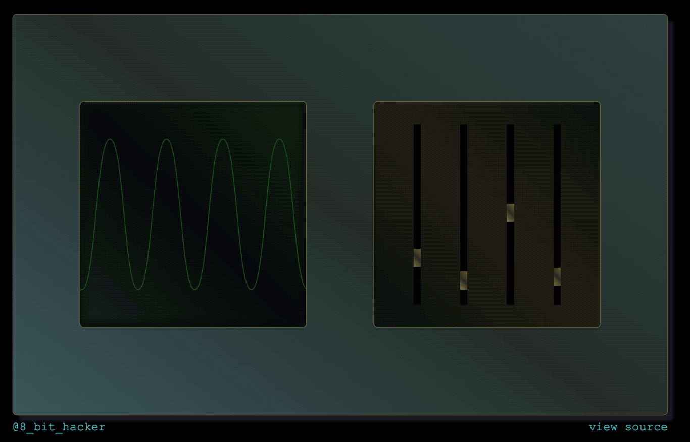

# css-animation-example
Example project demonstrating how to create custom animations in CSS3

## Overview
This project demonstrates how to animate simple objects on-screen with CSS3. The source is written in pure HTML/CSS so nothing aside from a web browser and simple code editor are required to test out this example.

Thanks for checking it out! ~ [#8_bit_hacker](https://twitter.com/8_bit_hacker)